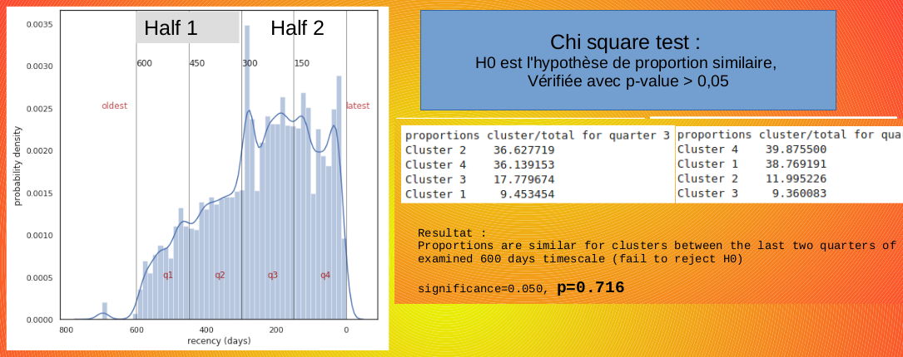

# E-commerce customers automatic classification by ML/AI

## 1.Background
The Brazilian e-commerce platform Olist would like to use artificial intelligence to automatically classify customers into categories. 

The business goal is to identify user types based on their personal data and buying behavior. This can help them with:

    1. Competitive pricing.
    2. Targeting customers.
    3. Decision making.
    4. Making better strategies.
    
Unsupervised machine learning should provide better results than traditional methods such as recency-frequency-monetary value (RFM) analysis.

Expected goals for this project: 

- offer to Olist Marketing team a straightforward visualization of the machine learning (ML) classification algorithm output.

- estimate the timespan for the ML classification pipeline and offer to Olist a reasonable maintenance contract.

## 2. The data

The Brazilian e-commerce company Olist dataset

https://www.kaggle.com/olistbr/brazilian-ecommerce

provides 9 csv files. Those spreadsheets can be combined into a Pandas dataframe to extract relevant information.

## 3. The model outcome

For details, you can consult the full [presentation describing target achievement to OList Marketing team](https://github.com/opsabarsec/E-commerce-customers-automatic-clustering/blob/master/segmentation_clients_fr.pdf)

Below an illustration of 4 clusters generated using the K-Means algorithm and represented after projection on the two main principal components

Test data fit well into those clusters, indicating a robust model. The evaluation of pipeline stability over time showed that maintenance is not needed at least for a year.

Calculations have been carried out using rapids.ai, running on Google COLABS GPUs

## 4. Conclusions

- Clusters obtained by machine learning correspond to distinct customers behaviors and can be used to improve marketing targets.

- Plotting « test » data in 2D using PCA showed that new customers will fit well into the segments.

- The Chi-Test showed K-means segmentation stability over 1-2 years timespan.

- Best selling products are for personal care, in the categories “bed-bath-table” and “health-beauty”

- EDA showed that most customers only bought once. This limits RFM analysis use.

Python code can be found in the following Jupyter notebooks:

[part 1: Data cleaning and exploration](https://github.com/opsabarsec/E-commerce-customers-automatic-clustering/blob/master/OList_part1.ipynb)

[part 2: Alghoritms for unsupervised clustering of the customers](https://github.com/opsabarsec/E-commerce-customers-automatic-clustering/blob/master/OList_part2.ipynb)
