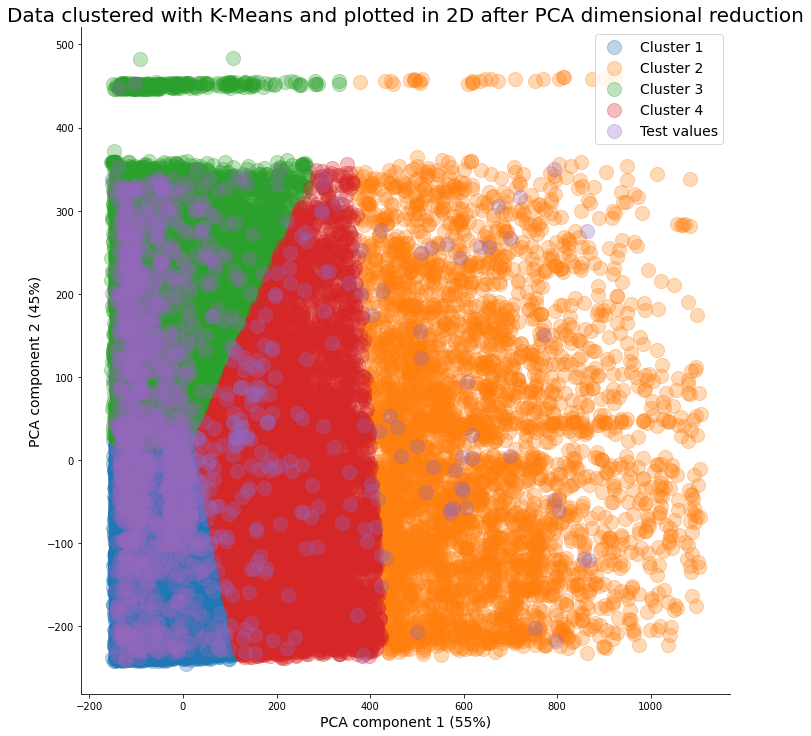

# E-commerce customers automatic classification by ML/AI
Customers unsupervised grouping from the Kaggle dataset

https://www.kaggle.com/olistbr/brazilian-ecommerce

Below an illustration of clusters generated using the K-Means alghorithm and represented after projection on the two main principal components

Calculations have been carried out using rapids.ai, running on Google COLABS GPUs

Python code can be found in the OList python notebooks

part 1: data cleaning and exploration
part 2: unsupervised clustering of the customers
